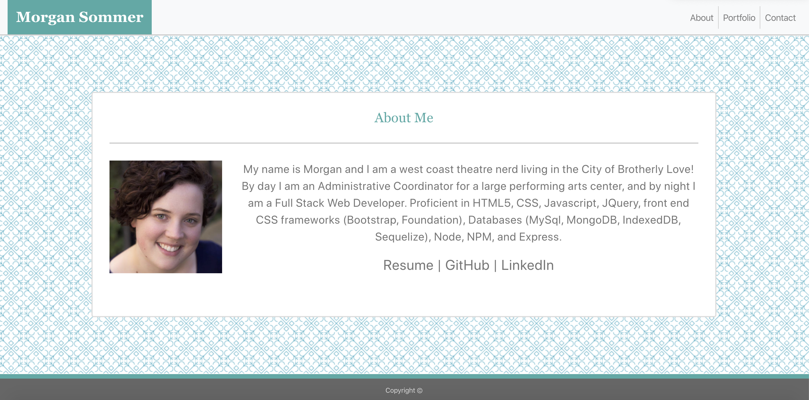

## Responsive-Portfolio

# Description

This React Portfolio was created so that I could showcase the projects I complete during my enrollment in the UPENN Coding Bootcamp, and share them with colleages and potential employers. This webite was built using React and React Router, and contains 3 pages, which include an About Me section, Contact Me form, and a Portfolio page which will eventually contain links to different projects. All pages are responsive to changes in browser size, and remained styled regardless of the device type.

# Screenshot

# Links

Deployed App:  https://intense-bastion-59343.herokuapp.com/

Github Repo:  https://github.com/mms211/React-Portfolio

# License

Copyright (c) 2020 Morgana Sommer

Permission is hereby granted, free of charge, to any person obtaining a copy of this software and associated documentation files (the "Software"), to deal in the Software without restriction, including without limitation the rights to use, copy, modify, merge, publish, distribute, sublicense, and/or sell copies of the Software, and to permit persons to whom the Software is furnished to do so, subject to the following conditions:

The above copyright notice and this permission notice shall be included in all copies or substantial portions of the Software.

THE SOFTWARE IS PROVIDED "AS IS", WITHOUT WARRANTY OF ANY KIND, EXPRESS OR IMPLIED, INCLUDING BUT NOT LIMITED TO THE WARRANTIES OF MERCHANTABILITY, FITNESS FOR A PARTICULAR PURPOSE AND NONINFRINGEMENT. IN NO EVENT SHALL THE AUTHORS OR COPYRIGHT HOLDERS BE LIABLE FOR ANY CLAIM, DAMAGES OR OTHER LIABILITY, WHETHER IN AN ACTION OF CONTRACT, TORT OR OTHERWISE, ARISING FROM, OUT OF OR IN CONNECTION WITH THE SOFTWARE OR THE USE OR OTHER DEALINGS IN THE SOFTWARE.